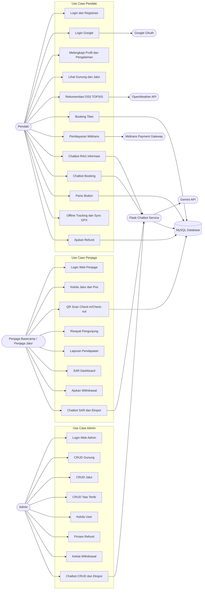

# Use Case Diagram

## Aktor Sistem

| Aktor | Peran |
| --- | --- |
| Pendaki | Menggunakan mobile app untuk mencari gunung/jalur, rekomendasi DSS, booking, pembayaran, panic button, refund, dan tracking. |
| Admin | Mengelola data master, pengguna, transaksi, refund, withdrawal, dan laporan melalui web admin. |
| Penjaga Basecamp / Penjaga Jalur | Mengelola jalur, scan QR, check-in/check-out, memantau SAR/panic, laporan pendapatan, dan withdrawal. |
| Flask Chatbot Service | Boundary eksternal internal yang menerima chat, membangun konteks RAG, dan memanggil Gemini/function tools. |
| Midtrans Payment Gateway | Memproses pembayaran, direct charge/Snap, status, callback notifikasi, QRIS. |
| Gemini API | Model LLM untuk chatbot RAG dan function calling. |
| Google OAuth | Autentikasi login Google melalui endpoint Laravel. |
| OpenWeather API | Sumber cuaca untuk risk assessment DSS dan endpoint weather. |
| MySQL Database | Penyimpanan data aplikasi dan retrieval untuk RAG. |

## Use Case Pendaki

- Registrasi dan login.
- Login dengan Google OAuth.
- Melengkapi profil dan onboarding pengalaman.
- Melihat gunung, jalur, detail jalur, preview jalur, dan aturan.
- Menyimpan preferensi DSS.
- Melihat rekomendasi jalur TOPSIS.
- Membuat booking tiket pendakian.
- Menambah anggota pesanan.
- Membayar melalui Midtrans.
- Mengecek status pembayaran.
- Menggunakan chatbot informasi.
- Membuat booking lewat chatbot.
- Mengirim panic request.
- Membatalkan panic request.
- Sinkronisasi track offline/GPX.
- Mengajukan refund.

## Use Case Admin

- Login web admin.
- Mengelola data gunung.
- Mengelola data jalur.
- Mengelola tata tertib.
- Mengelola pengguna.
- Memverifikasi transaksi manual.
- Memproses refund.
- Mengelola withdrawal request penjaga.
- Mengatur biaya admin.
- Menggunakan chatbot admin untuk ringkasan/ekspor/CRUD.

## Use Case Penjaga Basecamp / Penjaga Jalur

- Login web penjaga.
- Melihat dashboard penjaga.
- Mengelola informasi jalur, GPX, pos jalur, kuota harian, dan izin refund.
- Scan QR/manual search pesanan.
- Check-in dan check-out pendaki.
- Melihat riwayat pengunjung.
- Melihat laporan pendapatan.
- Memantau panic/SAR dashboard.
- Merespons dan menyelesaikan panic request.
- Mengajukan withdrawal.
- Menggunakan chatbot penjaga untuk SAR dan ekspor.

## Use Case Layanan Eksternal

- Midtrans membuat instruksi pembayaran/Snap/direct charge.
- Midtrans mengirim notification callback.
- Gemini API menerima prompt dengan konteks database dan mengembalikan respons/function call.
- Google OAuth memvalidasi login Google.
- OpenWeather API menyediakan data cuaca terkini/forecast untuk DSS dan weather endpoint.

## Diagram Use Case

Mermaid tidak memiliki notasi use case UML native yang ideal. Diagram berikut memakai `flowchart` dengan aktor dan use case sebagai node.

