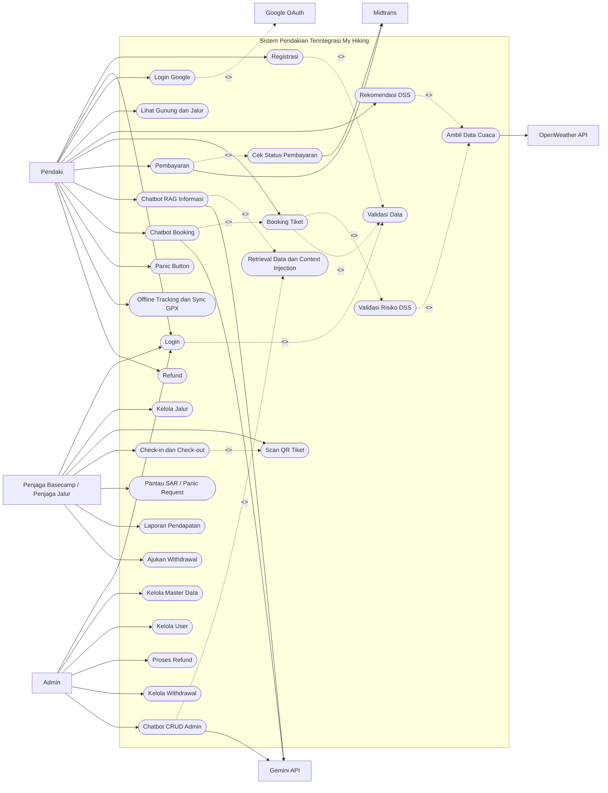

# Use Case Diagram

## Aktor Sistem

- **Pendaki**: pengguna mobile app yang melakukan pencarian jalur, booking, pembayaran, chatbot, panic button, tracking, dan refund.
- **Penjaga Basecamp / Penjaga Jalur**: pengguna web penjaga yang mengelola jalur, melakukan scan QR, check-in/check-out, dan memantau panic request.
- **Admin**: pengguna web admin yang mengelola data master, transaksi, refund, withdrawal, dan laporan.
- **Layanan Eksternal**: Midtrans, Gemini API, Google OAuth, dan OpenWeather API.

## Use Case Utama

- Pendaki: registrasi/login, lihat gunung dan jalur, rekomendasi DSS, booking tiket, pembayaran, chatbot, panic button, offline tracking, dan refund.
- Penjaga: login, kelola jalur, scan QR, check-in/check-out, pantau SAR, laporan pendapatan, dan withdrawal.
- Admin: login, kelola master data, kelola user, proses refund, kelola withdrawal, dan chatbot admin.
- Layanan eksternal: autentikasi Google, pembayaran Midtrans, respons Gemini, dan data cuaca OpenWeather.

## Diagram Use Case Sederhana

Mermaid tidak menyediakan notasi use case UML murni. Diagram berikut memakai `flowchart` dengan node berbentuk oval/stadium agar mendekati bentuk use case diagram konvensional.

## Catatan

- Diagram dibuat ringkas agar mudah ditempatkan pada BAB III.
- Detail skenario setiap fitur tetap dijelaskan pada `02_USE_CASE_SCENARIOS.md`.
- CRUD chatbot admin untuk mutasi `/api/mountains`, `/api/routes`, dan alias `/api/trails` tetap **perlu verifikasi** sesuai catatan validasi karena endpoint API mutasi tidak ditemukan pada `routes/api.php`.

