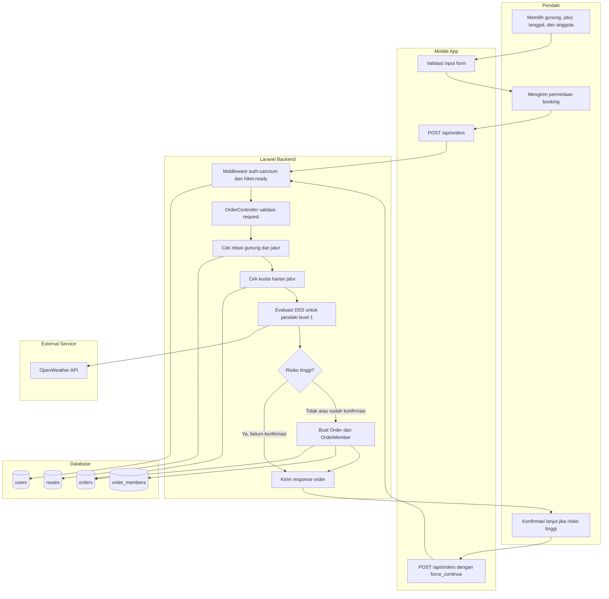
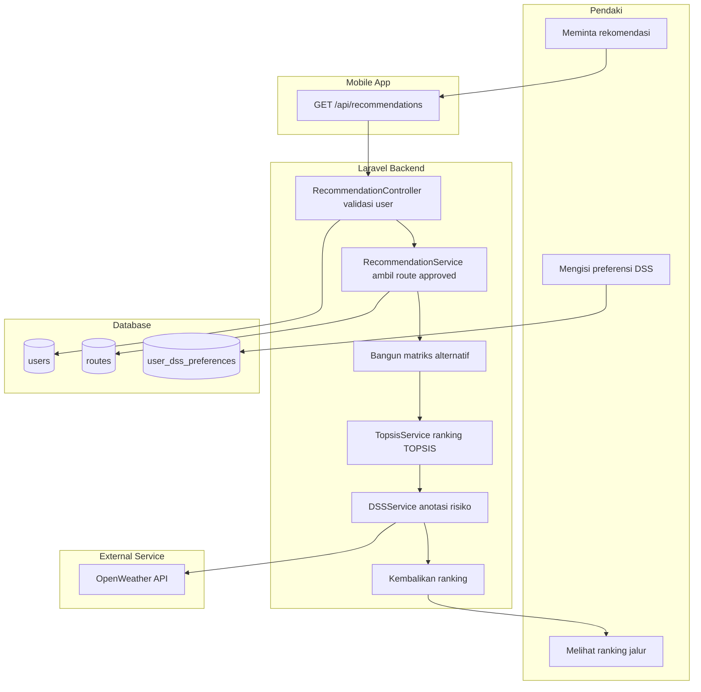
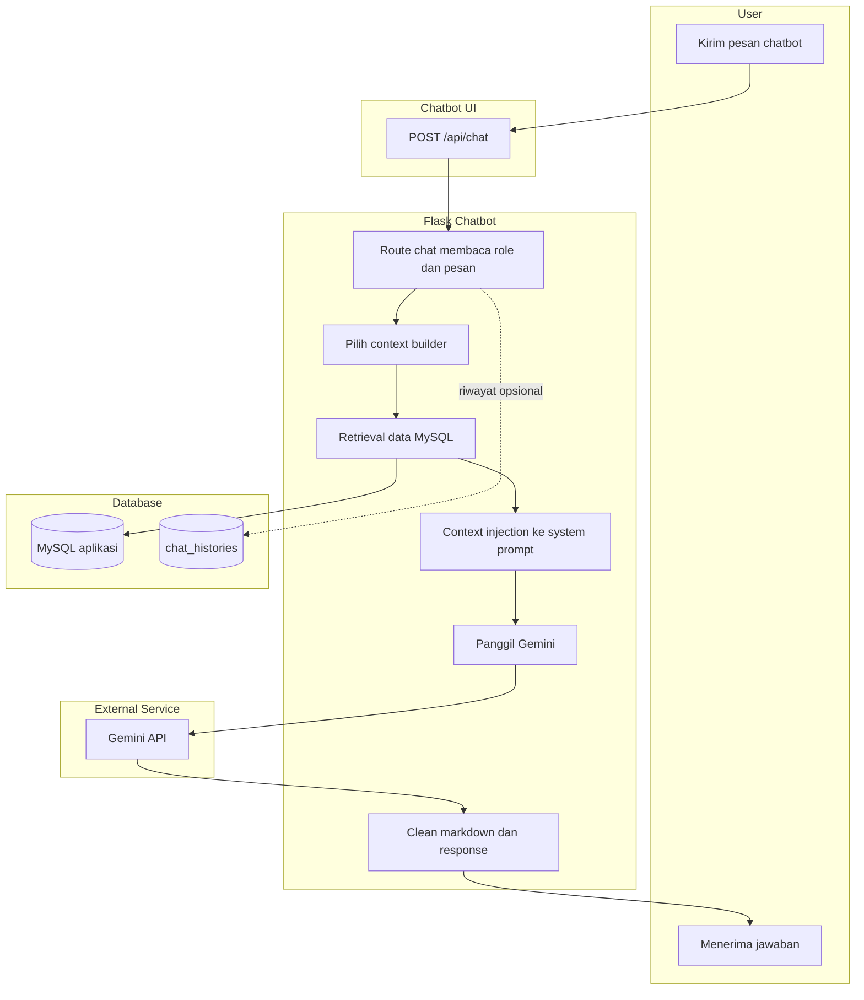
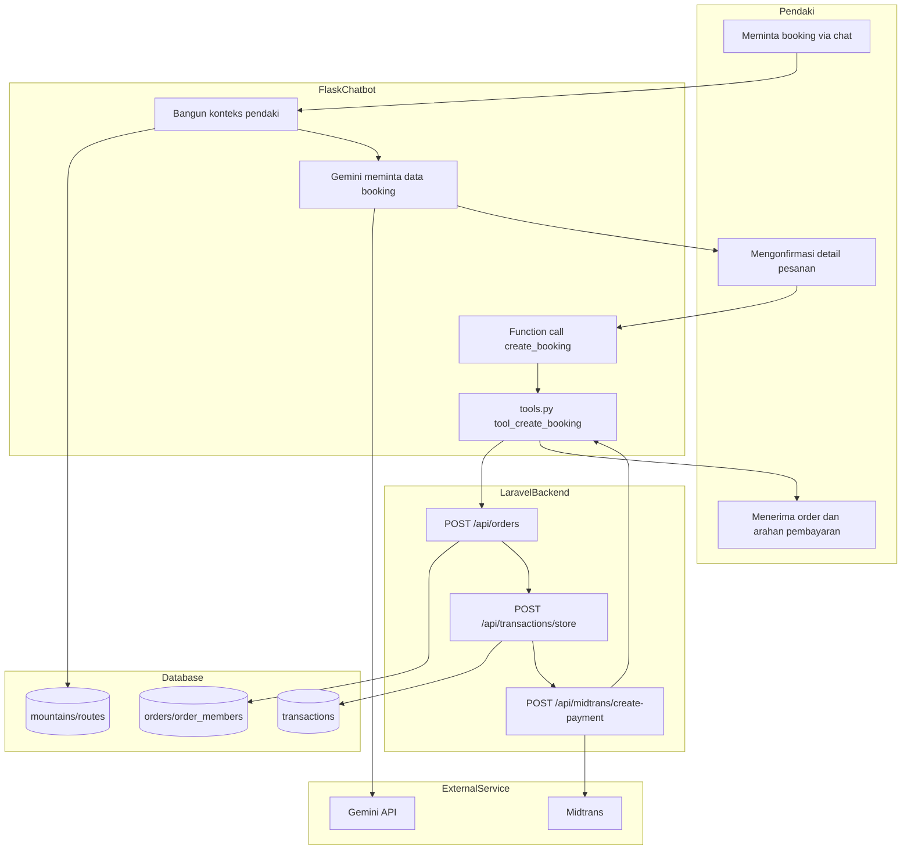

# Activity Diagrams

## 1. Booking Tiket + Validasi DSS



## 2. Pembayaran Midtrans

```mermaid
flowchart TD
    subgraph Pendaki
        A1[Memilih Bayar Sekarang]
        A2[Menyelesaikan pembayaran]
    end

    subgraph MobileApp["Mobile App"]
        B1[POST /api/midtrans/create-payment]
        B2[Tampilkan instruksi, QRIS, deeplink, atau Snap]
        B3[Polling GET /api/payment/status/{orderId}]
    end

    subgraph LaravelBackend["Laravel Backend"]
        C1[MidtransController createPayment]
        C2[Hitung total pembayaran]
        C3[Create/update Transaction]
        C4[Handle callback notification]
        C5[Verifikasi signature]
        C6[Update status transaksi dan order]
    end

    subgraph Database
        D1[(orders)]
        D2[(transactions)]
    end

    subgraph ExternalService["External Service"]
        E1[Midtrans Direct Charge atau Snap]
        E2[Midtrans Notification]
    end

    A1 --> B1 --> C1
    C1 --> D1 --> C2
    C2 --> E1 --> C3 --> D2
    C3 --> B2 --> A2
    A2 --> E2 --> C4 --> C5
    C5 --> C6 --> D2
    C6 --> D1
    B2 --> B3 --> C6
```

## 3. Rekomendasi DSS TOPSIS



## 4. Chatbot RAG



## 5. Chatbot Booking



## 6. QR Check-in dan Check-out

```mermaid
flowchart TD
    subgraph Penjaga
        A1[Buka scanner]
        A2[Scan QR atau input manual]
        A3[Melihat hasil status]
    end

    subgraph WebPenjaga["Web Penjaga"]
        B1[GET /guards/scanner]
        B2[POST /guards/scanner/auto-scan/{id}]
    end

    subgraph LaravelBackend
        C1[TrailGuardController autoScan]
        C2[Validasi jalur milik penjaga]
        C3[Validasi transaksi Complete]
        C4{Status order}
        C5[Set Sedang Mendaki dan check_in]
        C6[Set Selesai dan check_out]
        C7[Tolak scan]
    end

    subgraph Database
        D1[(routes)]
        D2[(orders)]
        D3[(transactions)]
    end

    A1 --> B1
    A2 --> B2 --> C1 --> C2 --> D1
    C2 --> D2
    C2 --> C3 --> D3
    C3 --> C4
    C4 -- Booking --> C5 --> D2 --> A3
    C4 -- Sedang Mendaki --> C6 --> D2 --> A3
    C4 -- Expired/Cancelled/Selesai/lainnya --> C7 --> A3
```

## 7. Panic Button

```mermaid
flowchart TD
    subgraph Pendaki
        A1[Menekan panic button]
        A2[Mengirim lokasi dan tipe darurat]
        A3[Menerima status panic]
    end

    subgraph MobileApp
        B1[POST /api/panic]
        B2[GET /api/panic/order/{orderId}]
    end

    subgraph LaravelBackend
        C1[Middleware auth dan hiker.ready]
        C2[PanicController validasi order]
        C3[Cek status Sedang Mendaki]
        C4[Cek panic aktif]
        C5[Buat PanicRequest pending]
        C6[SarDashboardController respond/resolve]
    end

    subgraph Database
        D1[(orders)]
        D2[(panic_requests)]
    end

    subgraph Penjaga
        E1[Memantau SAR dashboard]
        E2[Merespons atau menyelesaikan]
    end

    A1 --> A2 --> B1 --> C1 --> C2 --> D1
    C2 --> C3 --> C4 --> D2
    C4 --> C5 --> D2 --> A3
    E1 --> C6 --> D2
    E2 --> C6
    A3 --> B2 --> D2
```

## 8. Offline Tracking dan Sync GPX

```mermaid
flowchart TD
    subgraph Pendaki
        A1[Mendaki dan merekam track offline]
        A2[Koneksi tersedia]
        A3[Menerima hasil sync]
    end

    subgraph MobileApp
        B1[Simpan cache GPX lokal]
        B2[POST /api/orders/{orderId}/offline-track-sync]
    end

    subgraph LaravelBackend
        C1[OrderController offlineTrackSync]
        C2[Validasi auth, order, dan kepemilikan]
        C3[Validasi status Sedang Mendaki]
        C4[Validasi ukuran GPX]
        C5[Cek duplikasi client_cache_id]
        C6[Simpan OfflineTrackSync]
    end

    subgraph Database
        D1[(orders)]
        D2[(offline_track_syncs)]
    end

    A1 --> B1 --> A2 --> B2 --> C1
    C1 --> C2 --> D1
    C2 --> C3 --> C4 --> C5 --> D2
    C5 -- Duplikat --> A3
    C5 -- Baru --> C6 --> D2 --> A3
```

## 9. Refund

```mermaid
flowchart TD
    subgraph Pendaki
        A1[Membuka refund preview]
        A2[Mengirim alasan dan metode refund]
        A3[Menerima status refund]
    end

    subgraph MobileApp
        B1[GET /api/refund-preview/{orderId}]
        B2[POST /api/refund-requests]
    end

    subgraph LaravelBackend
        C1[RefundRequestController preview]
        C2[Validasi order, transaksi, izin refund]
        C3[RefundCalculationService calculate]
        C4[RefundRequestController store]
        C5[Buat refund pending dan set Cancel Requested]
        C6[Admin approve/reject/refunded]
    end

    subgraph Database
        D1[(orders)]
        D2[(transactions)]
        D3[(routes)]
        D4[(refund_requests)]
    end

    subgraph Admin
        E1[Melihat refund request]
        E2[Approve, reject, atau tandai refunded]
    end

    A1 --> B1 --> C1 --> C2
    C2 --> D1
    C2 --> D2
    C2 --> D3
    C2 --> C3 --> A1
    A2 --> B2 --> C4 --> C2
    C4 --> C5 --> D4
    C5 --> D1
    E1 --> C6
    E2 --> C6 --> D4
    C6 --> D1
    A3 --> D4
```

