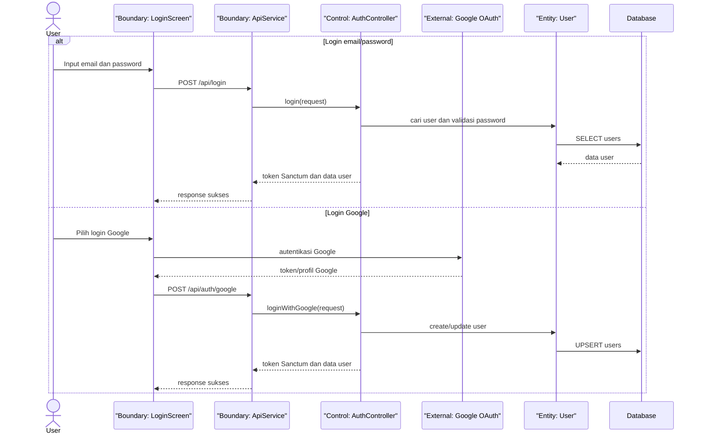
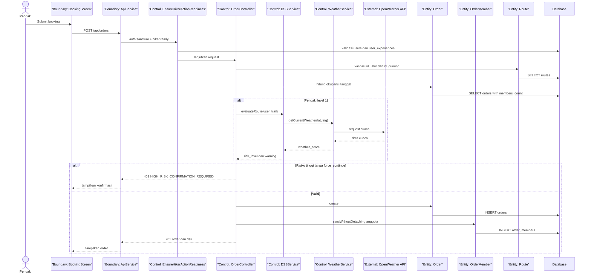
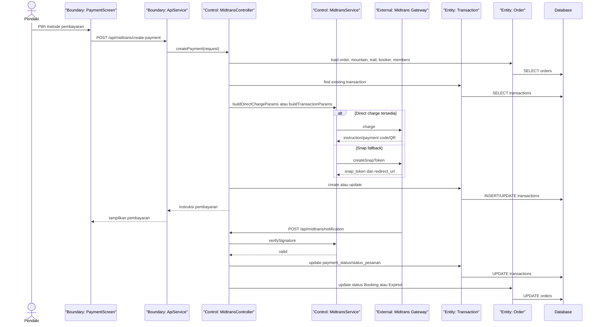
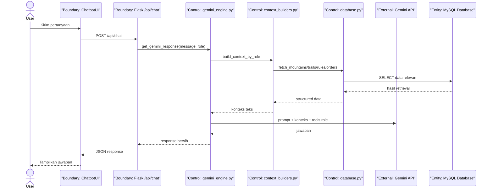
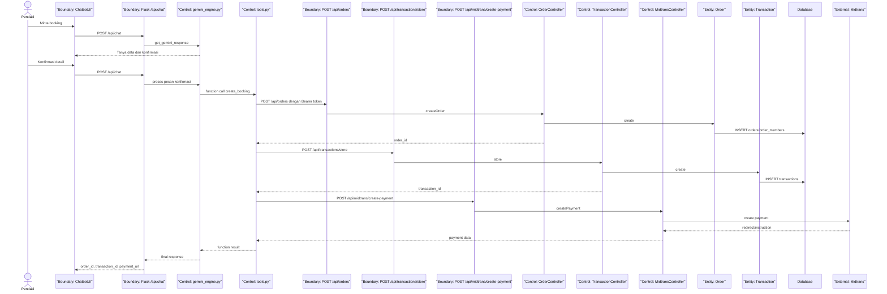
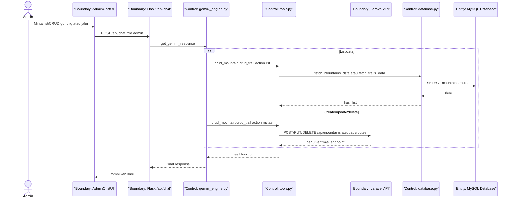
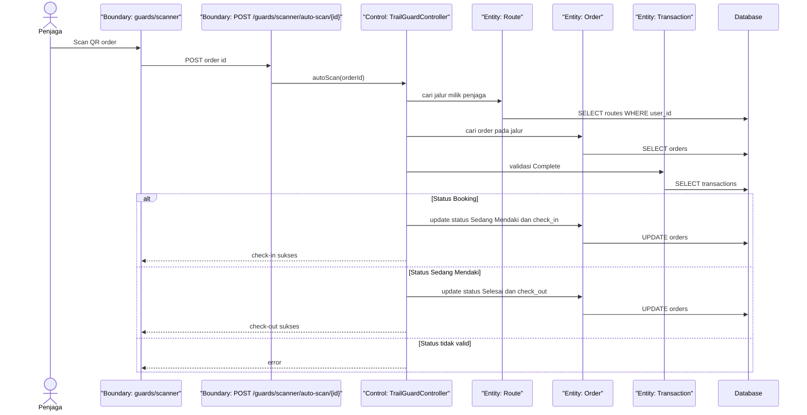
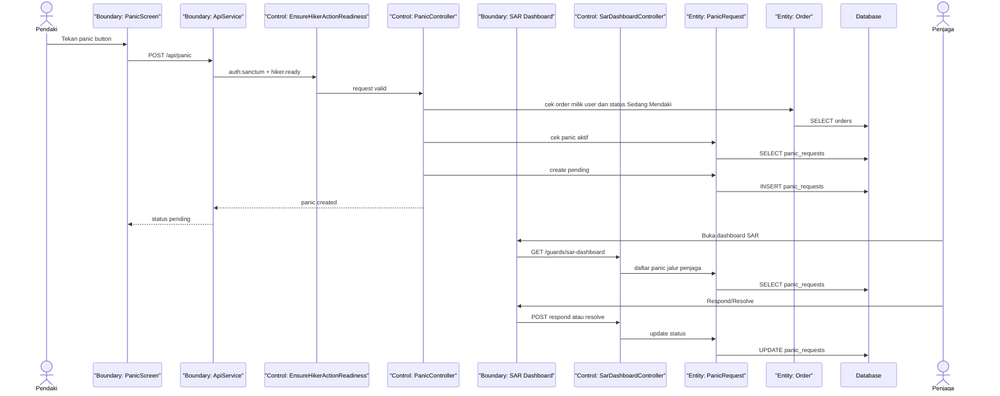
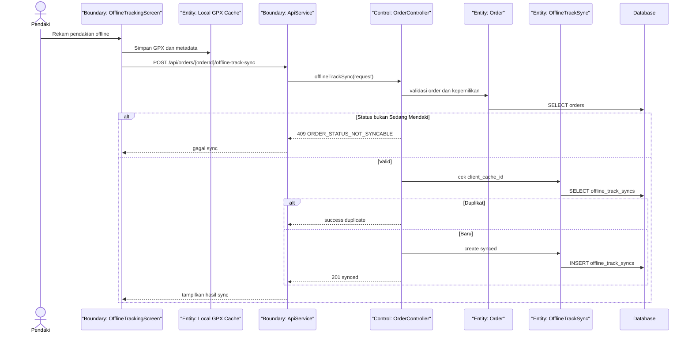

# Sequence Diagrams

## 1. Login

## 2. Booking Tiket + DSS

## 3. Pembayaran Midtrans

## 4. Chatbot RAG Informasi

## 5. Chatbot Booking

## 6. Chatbot CRUD Admin

Catatan: endpoint mutasi `/api/mountains`, `/api/routes`, dan alias `/api/trails` tidak ditemukan pada `routes/api.php`; bagian ini perlu verifikasi.

## 7. QR Check-in dan Check-out

## 8. Panic Button

## 9. Offline Sync GPX

