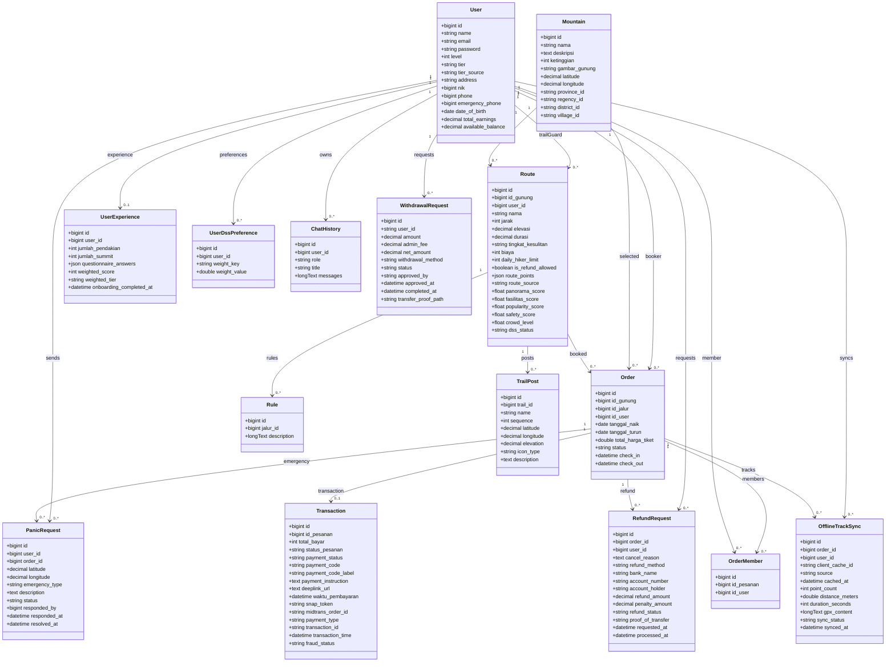

# Class Diagram

Diagram berikut memodelkan entitas domain utama berdasarkan model Laravel, migration, serta tabel `chat_histories` yang digunakan Laravel/Flask chatbot.

## Catatan Class Diagram

- Model `Trail` menggunakan tabel `routes`; pada diagram diberi nama class `Route` agar konsisten dengan nama tabel dan domain jalur.
- `Order.check_in` dan `Order.check_out` digunakan oleh `TrailGuardController`, tetapi migration eksplisit penambahan kolom tersebut tidak ditemukan pada file yang dianalisis. Atribut ini perlu verifikasi pada skema database aktual.
- `OrderMember` model memiliki fillable `id_users`, sedangkan migration dan relasi memakai `id_user`. Ini perlu verifikasi karena dapat memengaruhi operasi model langsung.
- `WithdrawalRequest.user_id` dan `approved_by` pada migration bertipe string, sedangkan sebagian relasi mengarah ke `users.id`. Ini perlu verifikasi tipe data.

