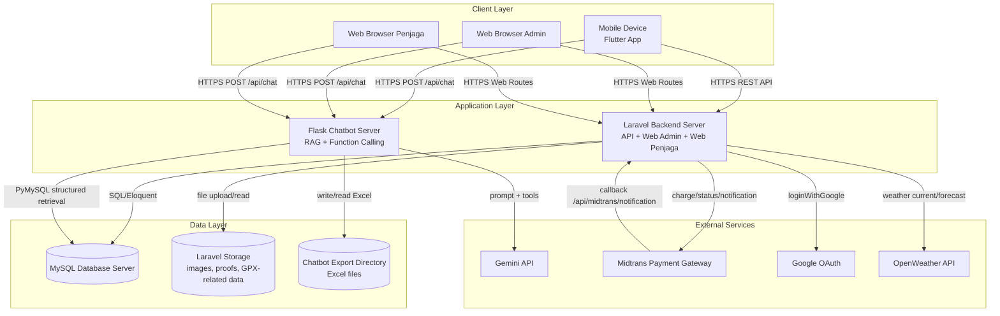

# Deployment Diagram

## Catatan Deployment

- Flask Chatbot Service tidak ditemukan di dalam folder backend Laravel, tetapi ditemukan pada folder `My_Hiking_Chatbot`.
- Flutter Mobile App tidak ditemukan pada workspace yang dianalisis; node mobile disertakan karena disebut sebagai bagian sistem.
- Chatbot mengambil data langsung dari MySQL untuk RAG, dan juga memanggil Laravel API untuk booking serta percobaan CRUD admin.
