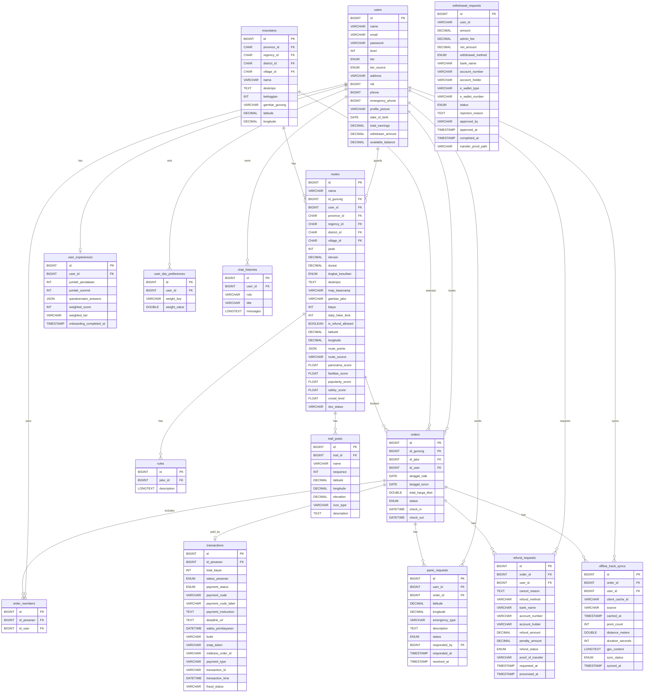

# Entity Relationship Diagram

ERD berikut berfokus pada tabel utama aplikasi. Tabel framework seperti `failed_jobs`, `password_reset_tokens`, `personal_access_tokens`, dan `notifications` tidak dimasukkan ke diagram utama.

## Catatan ERD

- `chat_histories` ada pada migration Laravel dan juga dibuat otomatis oleh Flask `database.py` jika belum ada.
- `withdrawal_requests` relevan untuk fitur penjaga dan admin earnings, sehingga dimasukkan.
- Kolom `check_in` dan `check_out` digunakan oleh controller web penjaga, tetapi migration eksplisitnya tidak ditemukan pada file yang dianalisis; perlu verifikasi.
- Tabel wilayah `reg_provinces`, `reg_regencies`, `reg_districts`, dan `reg_villages` menjadi referensi lokasi, tetapi tidak ditampilkan agar ERD utama tetap fokus.

